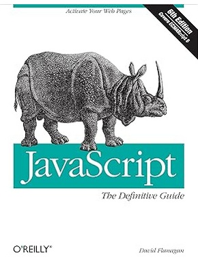
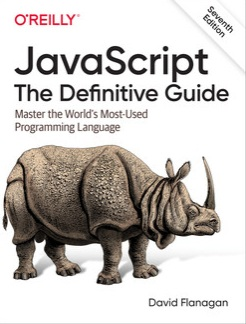

# 📘 JavaScript: The Definitive Guide – Drills & Exercises

This repository includes coding drills and exercises based on the two major editions of **JavaScript: The Definitive Guide**:

- 📙 **6th Edition (2011)**
- 📘 **7th Edition (2020)**

---

## 📂 Folder Structure
.
├── 2011-6th-edition/
├── 2020-7th-edition/
├── images/
└── README.md

- `2011-6th-edition/`: Practice problems and notes based on the older edition.
- `2020-7th-edition/`: Updated exercises using modern JavaScript concepts.

---

## ✅ Fixes & Changes

- Renamed all files consistently using `camelCase.js`.
- Organized by book edition.
- Added book cover images for quick visual reference.

---

## 🖼 Book Covers

| 6th Edition                         | 7th Edition                         |
|------------------------------------|-------------------------------------|
|  |  |

---

## 📌 Notes

- Exercises are written in plain JavaScript (`.js`) files.
- Some files use `node` features for quick testing (like `console.log`).
- Ideal for practice, learning, and revisiting JavaScript fundamentals.

---

## 📄 License

This repository is for **personal educational use only**.
